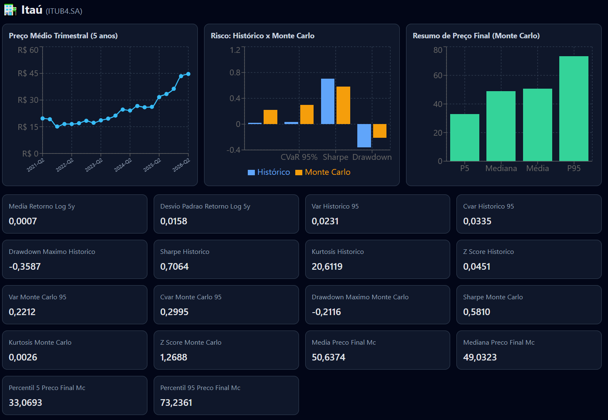

# MonteCarlo Stock Dashboard

Projeto de análise quantitativa de ativos com **engenharia de features**, **simulação de Monte Carlo (GBM multivariado)** e **dashboard interativo em React**.

## Objetivo

Fornecer uma visão prática de risco e retorno para os ativos:

- `VALE3.SA`
- `PETR4.SA`
- `ITUB4.SA`

A ideia é combinar dados históricos dos últimos 5 anos com cenários simulados para apoiar comparação entre ativos.

## O que o projeto faz

1. Baixa preços históricos via Yahoo Finance
2. Calcula features e métricas de risco históricas
3. Simula trajetórias futuras com GBM multivariado (com correlação)
4. Gera arquivos de saída (`.csv`, `.png`, `.json`)
5. Exibe tudo em um dashboard com abas de ativo, comparativo geral e notícias

## Métricas calculadas

### Features de mercado

- Retornos logarítmicos
- Volatilidade histórica anualizada (janela de 21 dias)
- Matriz de correlação

### Monte Carlo (GBM)

- Simulação com:
  - 252 dias úteis
  - 2000 simulações
  - semente fixa (`seed=42`)
  - decomposição de Cholesky para correlação entre ativos
- Resumo dos preços finais simulados:
  - média
  - mediana
  - percentil 5
  - percentil 95

### Métricas de risco (Histórico e Monte Carlo)

- VaR 95%
- CVaR 95%
- Drawdown máximo
- Índice de Sharpe anualizado
- Kurtosis
- Z-score do último retorno

### Comparativo geral

- Tabela lado a lado: histórico vs Monte Carlo
- Gráficos de barras por ativo (VaR, Sharpe, CVaR histórico)
- Gráfico de linha com preço médio trimestral dos 3 ativos
- Sugestão de melhor ativo com base em ranking de risco-retorno

## Notícias

A pipeline também gera `noticias.json` com notícias da última semana relacionadas aos 3 ativos.

- Fonte: `yfinance` (`Ticker.news`)
- Filtro temporal: últimos 7 dias
- Exibidas na aba **Notícias** do dashboard

## Tecnologias usadas

### Backend / Quant

- Python 3.12
- `pandas`
- `numpy`
- `yfinance`
- `matplotlib`

### Frontend

- Vite
- React
- Recharts

### Scripts utilitários

- `dashboard/scripts/sync-data.mjs` para sincronizar dados de `output/` para `dashboard/public/data/`

## Estrutura principal

```text
main.py
output/
dashboard/
  src/
  public/data/
  scripts/sync-data.mjs
```

## Como executar

## 1) Rodar pipeline Python

Na raiz do projeto:

```powershell
& ".\.venv\Scripts\python.exe" ".\main.py"
```

Isso atualiza os artefatos em `output/`.

## 2) Sincronizar dados para o frontend

```powershell
cd .\dashboard
npm.cmd run sync-data
```

## 3) Subir dashboard local

```powershell
npm.cmd run dev
```

Acesse: `http://localhost:5173/`

## Saídas geradas

- `output/precos_fechamento.csv`
- `output/retornos_logaritmicos.csv`
- `output/volatilidade_historica_anualizada.csv`
- `output/matriz_correlacao.csv`
- `output/monte_carlo_gbm_resumo.csv`
- `output/metricas_risco.csv`
- `output/metricas_risco_monte_carlo.csv`
- `output/metricas_risco_comparativo.csv`
- `output/fan_chart_*.png`
- `output/noticias.json`

## Screenshots

Salve as capturas em `docs/screenshots/` para que apareçam no README.

### Visão geral



[Aba de VALE3](docs/screenshots/Vale-tab.PNG)

[Aba de PETR4](docs/screenshots/BR-tab.PNG)


### Como capturar (rápido)

1. Rode o dashboard com `npm.cmd run dev`
2. Abra `http://localhost:5173/`
3. Faça as capturas e salve com os nomes acima em `docs/screenshots/`

## Observações

- Este projeto tem caráter educacional/analítico.
- Não constitui recomendação financeira profissional.
